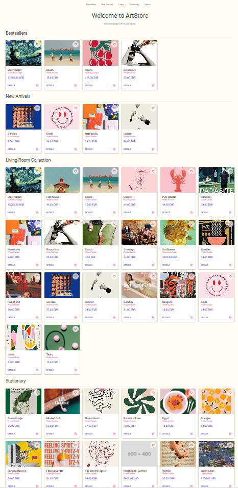
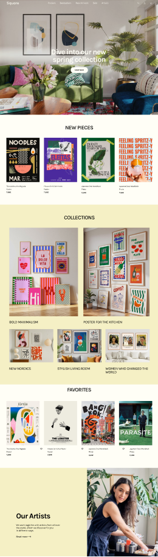

# 🎨 ArtStore - Modern E-Commerce Platform (.NET 9)

> A full-stack, cloud-native ready e-commerce solution for selling art prints. Built with cutting-edge .NET technologies, Clean Architecture, and a modular design.

## 🚀 Overview

**ArtStore** demonstrates how to build a scalable, maintainable enterprise application using the latest Microsoft stack. It features backend API implementing **CQRS** pattern and responsive **Blazor WebAssembly** frontend with **MudBlazor** UI components.
The system handles product catalog management, user authentication (JWT), shopping cart logic with database persistence, and order processing simulation.

This project demonstrates the full software development lifecycle: from business analysis (BRD) and UX/UI design, through software architecture (SAD), to complete .NET/C# implementation.

---

## 📊 Documentation (Business & Architecture)
As part of this project, I performed a system gap analysis and documented the transition. For compare purposes, the old version before analysis is waiting for you in branch called "OLD-VERSION".
* [📄 Business Requirements Document (BRD)](docs/Artstore_BRD.md) - Focuses on "What" and "Why" (Business Goals, System Capabilities, SEO requirements).
* [📐 Software Architecture Document (SAD)](docs/Artstore_SAD.md) - Focuses on "How" (Database Schema, API refactoring, DTOs, Blazor Routing).
* 

---

## 🎨 UI / UX Design
The cooperation with graphic designer give a touch of ART to design of the shop. The new frontend was completely redesigned before implementation. Here's the leak of change for home page.

### Homepage Redesign (Before & After)
<p align="center">
  
  
</p>

## ✨ Key Features

### 🛒 Shopping Experience
- **Dynamic Catalog:** Filter artwork by Category, Collection, Price range, and Frame type.
- **Product Details:** High-quality image zoom, artist bio, and related works.
- **Persistent Cart:** Shopping cart items are stored in the database, allowing users to switch devices without losing data.

### 🔐 User & Security
- **Registration & Login:** Secure identity system with hashed passwords.
- **Role-Based Access:** (Prepared for Admin/User roles).
- **Token Management:** Automatic JWT token handling in HTTP headers.

### ⚙️ Developer Experience (DX)
- **Automatic Seeding:** The database is automatically populated with sample data (Van Gogh, Monet) on startup.
- **Global Error Handling:** Centralized exception handling middleware.

---

## 🛠️ Getting Started / How to Run Locally

Follow these steps to set up and run the application on your local machine.

### Prerequisites
* [.NET 10.0 SDK]
* SQL Server (e.g., SQL Server Express / LocalDB or Docker container)
* IDE: Visual Studio 2022, JetBrains Rider, or VS Code

### 1. Clone the repository
```bash
git clone https://github.com/SzymonSiwak/Artstore.git
cd Artstore
```

### 2. Configure the Database
The project uses Entity Framework Core with SQL Server. By default, it connects to local SQL Server Express. 

Navigate to the API project folder and check the `appsettings.json` file. Update the `DefaultConnection` string if your local SQL instance has a different name.

```json
"ConnectionStrings": {
  "DefaultConnection": "Server=(localdb)\\mssqllocaldb;Database=ArtStoreDb;Trusted_Connection=True;MultipleActiveResultSets=true"
}
```

### 3. Apply Migrations & Seed Data
To create the database schema and populate it with initial data, run the following command in the terminal (ensure you are in the API project directory):

```bash
cd src/ArtStore.API
dotnet ef database update
```
*(Alternatively, run `Update-Database` in the Package Manager Console in Visual Studio).*

### 4. Run the Application
The solution consists of a Backend (API) and a Frontend (Blazor). You need to run both.

**Using Visual Studio:**
1. Right-click on the Solution -> `Configure Startup Projects...`
2. Select `Multiple startup projects`.
3. Set the action for both the API and Blazor UI projects to `Start`.
4. Press `F5`.

**Using .NET CLI:**
Open two separate terminal windows.

*Terminal 1 (Backend):*
```bash
cd src/ArtStore.API
dotnet run
```

*Terminal 2 (Frontend):*
```bash
cd src/ArtStore.Blazor
dotnet run
```

The UI should now be accessible at `https://localhost:<port>` (check the terminal output for the exact port).

##🗺️ Roadmap & Future Plans

Payment Gateway: Integration with Stripe for real transactions.

Admin Panel: Dashboard for managing products and orders.

Email Notifications: Background service (Worker) for sending order confirmations using RabbitMQ.

Containerization: Docker support for easy deployment.

.NET Aspire: Orchestration for cloud-native development.
